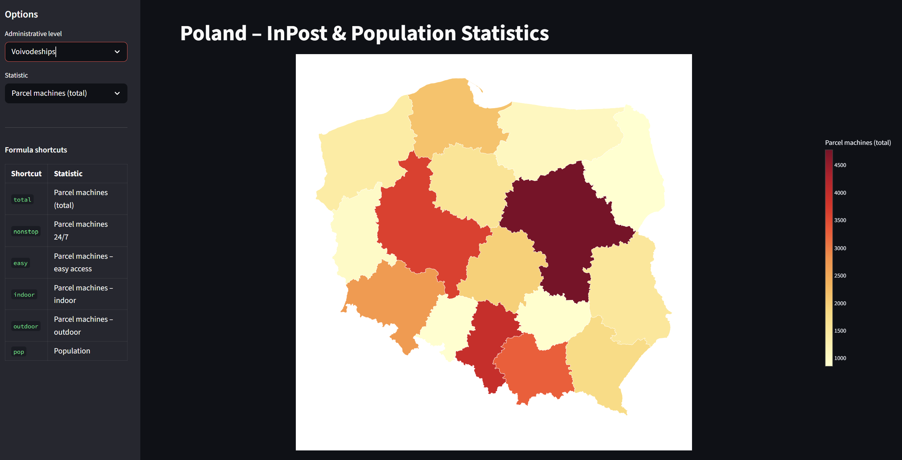
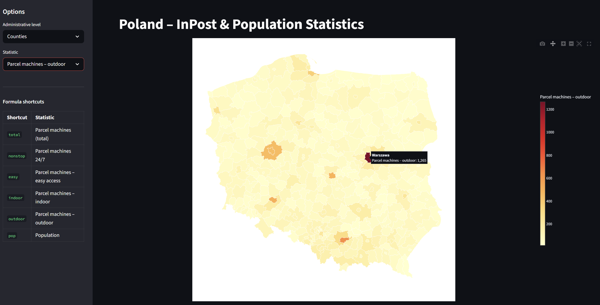
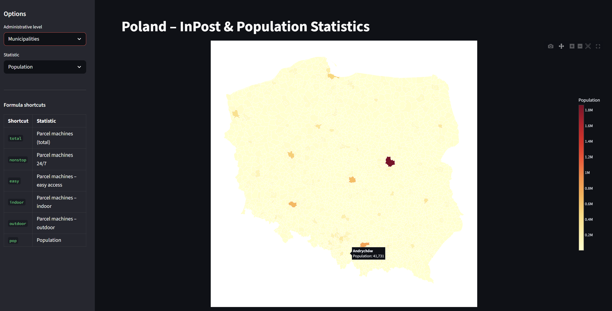
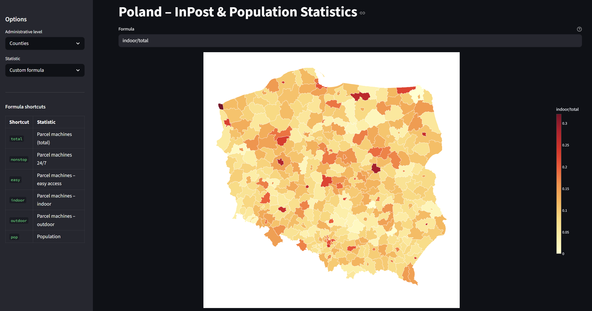
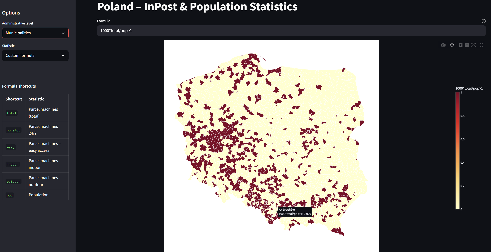

# InPost Poland — Coverage & Density Dashboard

An interactive choropleth dashboard that maps InPost parcel locker statistics across Poland's administrative hierarchy and lets you ask your own questions through a live formula engine.

---

## What I Built

A two-part project: a **data pipeline** that fetches and joins three data sources into analysis-ready Parquet files, and a **Streamlit dashboard** that visualises the results.

The dashboard shows parcel machine counts (total, 24/7, easy-access, indoor, outdoor) and population at three administrative levels — voivodeships, counties, and municipalities. A built-in formula engine lets you type expressions like `total / pop * 100000` or `(nonstop > outdoor) & (pop > 50000)` and instantly see the result on the map.

---

## The Problem I Chose to Solve

Raw parcel machine counts are not that interesting on their own. Warsaw naturally has the most machines — it also has 1.8 million people. The question that actually matters is: **which areas are underserved relative to their population?**

Answering this question drove every decision: fetching a second data source (Poland's official population statistics), joining it to the InPost data by administrative unit, and building a formula layer so the map can express ratios, thresholds, and comparisons — not just raw totals.

The formula engine doubles as an exploratory tool. Instead of hard-coding a list of derived metrics, it lets anyone answer their own questions without touching the code.

---

## Demo

### Voivodeship View


### Counties View


### Municipalities View


### Custom Counties View


### Custom Municipalities View


To run it yourself, follow the Getting Started steps below. The full pipeline takes a few minutes on first run; subsequent runs skip already-fetched files.

---

## Getting Started

**Prerequisites:** Python 3.11+

```bash
git clone <repo-url>
cd InPost_Project
pip install -r requirements.txt
```

**Step 1 — fetch raw InPost data** (run once; downloads ~150 000 points across Europe):

```bash
python fetch_inpost.py
```

**Step 2 — build the dataset** (all remaining steps, skips already-fetched files automatically):

```bash
python pipeline.py
```

**Step 3 — launch the dashboard:**

```bash
streamlit run app.py
```

Open `http://localhost:8501` in your browser.

---

## How It Works

```
fetch_inpost.py        → data/inpost_points.json        (InPost API, all Europe)
parse_inpost.py        → data/{CC}.parquet               (split by country)
fetch_boundaries.py    → data/poland.*.json              (GeoJSON admin boundaries)
fetch_populations.py   → data/populations_*.parquet      (GUS BDL API, population variable)
build_dataset.py       → data/*_data.parquet             (spatial join + population merge)
app.py                                                   (Streamlit dashboard)
```

`pipeline.py` runs steps 2–5 in order. Step 1 (`fetch_inpost.py`) is intentionally separate because it hits the live API and takes time — the rest of the pipeline works from cached files.

**Spatial join:** InPost point coordinates are joined to administrative polygons using GeoPandas `sjoin`. This is more reliable than name matching — coordinates don't have spelling variants or historical renames.

**Population join:** Population is joined by administrative unit name. The GeoJSON and GUS API use slightly different naming conventions (year suffixes like *"Wałbrzych od 2013"*, a 2021 county rename, municipality disambiguators), so `build_dataset.py` normalises both sides before merging. The result is 100% match at all three levels.

---

## Technical Decisions

| Decision | Rationale |
|---|---|
| **Parquet instead of CSV** | Typed columns (no silent float→string coercions), ~5× smaller files, fast columnar reads — matters when loading 2 477-row municipality data on every Streamlit interaction |
| **Second data source (GUS BDL)** | Raw counts are misleading without population context. The GUS BDL REST API is the authoritative source for Polish administrative statistics |
| **Formula engine via Python `eval`** | `pandas.DataFrame.eval` only handles arithmetic. Using Python's `eval` with a controlled namespace (no builtins, explicit numpy functions) gives full expression support — comparisons, boolean ops, math functions — without adding a parser dependency |
| **Boolean → float coercion** | Plotly choropleth requires numeric `z` values. Boolean Series (from comparisons) are silently cast to 0.0 / 1.0 so the map renders correctly |
| **Mercator projection** | The default equirectangular projection assigns equal pixel width to degrees of latitude and longitude. At 52 °N a degree of longitude is ~39% shorter than a degree of latitude, which makes Poland look artificially wide and flat. Mercator renders it at correct proportions |
| **Skip-if-exists in every script** | The API calls are slow and rate-limited. Every script checks for its outputs before fetching, making re-runs fast and the pipeline safe to interrupt and restart |
| **`terc` as the join key for InPost→boundary** | The GeoJSON files carry TERC administrative codes as stable, unambiguous identifiers. Spatial join assigns a TERC to each InPost point, so the final aggregation is always exact regardless of name formatting |

---

## Assumptions

- **Population variable 72305** in the GUS BDL API is total resident population. This is the standard variable used in official demographic publications.
- **Latest available year** is used for population (max year in the API response). At time of writing this is 2024 for most units.
- **Poland only.** The InPost API covers 15 European countries; the pipeline fetches all of them but the dashboard analyses only Poland, where the network is densest and official administrative statistics are readily available.
- **Points outside any polygon** (e.g. on a border) are dropped from aggregation rather than assigned heuristically. In practice this affected fewer than 5 of ~34 000 Polish points.

---

## If I Had More Time

- **Normalisation built into the UI** — a toggle to switch between absolute counts and per-100 000 population, so the formula `total / pop * 100000` is not something the user has to type.
- **Other countries** — the pipeline already fetches all 15 country Parquet files. Extending the dashboard to non-Polish markets requires sourcing equivalent boundary GeoJSON and population data for each country.
- **Deployment** — the app runs entirely from static files after the pipeline completes, making it a good candidate for Streamlit Community Cloud with the pre-built Parquet files committed to the repo.
